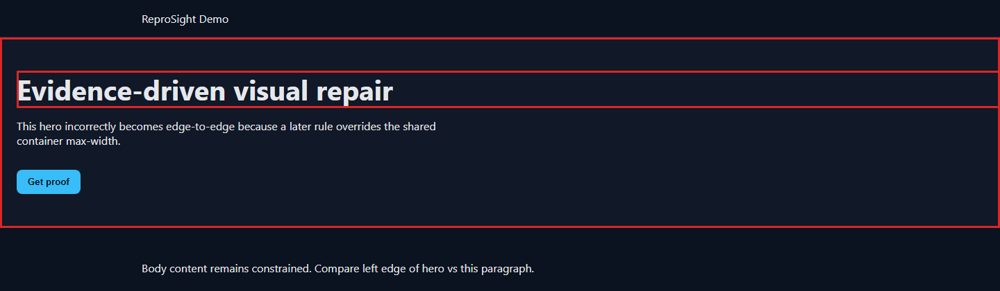
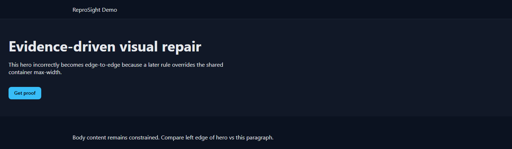
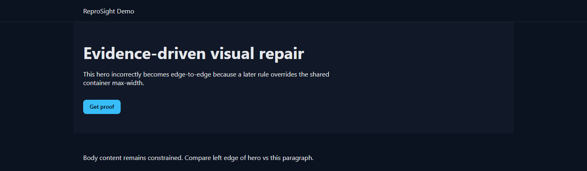
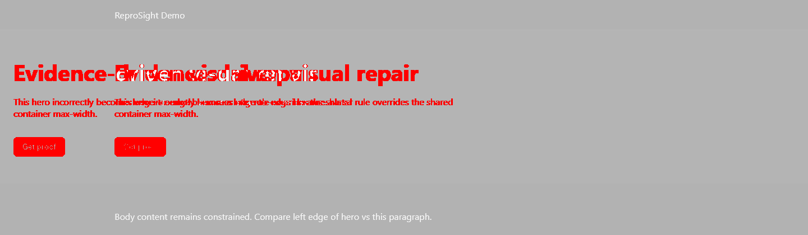

# ReproSight — Evidence-driven AI Visual Repair

**Tell your coding agent about a UI defect. The agent operates ReproSight to reproduce it, repair it in an isolated workspace, and prove the repair through regression checks.**

Coding agents can propose a UI repair. **ReproSight requires that repair to prove itself.**

```text
User → Coding agent (Claude Code / Codex / Cursor / …)
          → reprosight agent contract/discover/run/workspace/verify
          → evidence + isolated worktree + verdict
          → human review still required
```

You (the human) do **not** need to write ReproSight JSON, pick ports/selectors, or run the CLI. Your coding agent does.

### What you say

> The checkout CTA is covered on mobile.  
> Use ReproSight to fix it and verify the result.

### Quick Install & Usage

No manual setup or configuration required. You can run ReproSight directly with `npx` or install it globally:

```bash
# Direct run via NPX (Recommended for AI Agents)
npx reprosight agent run --repo . --description "Checkout CTA button is covered on mobile" --json

# Global installation via NPM
npm install -g reprosight

# Or install from GitHub Release tarball
npm install -g https://github.com/tungcorn/ReproSight/releases/latest/download/reprosight-latest.tgz
```

### What the agent does internally

`contract` → `discover` → `run` (reproduce + evidence) → `workspace` → edit → `verify` → `report`

- External agent: reasoning + code edits  
- ReproSight: deterministic browser evidence, CSS candidates, worktree isolation, patch policy, regressions  
- Success only when verification is `TARGET_FIXED_REGRESSIONS_PASSED`  
- Advanced JSON config/issue workflow remains available for power users  

## Flagship proof: container constraint regression

At the desktop viewport, a later `.hero` rule clears the shared `.container` max-width and forces a `1600px` minimum width, so the hero stretches edge-to-edge and the document scrolls horizontally.

**State:** `1440 × 900` · en · dark · **Detector:** horizontal overflow · **Patch:** 2 declarations removed from `styles.css` · **Verdict:** target fixed, regressions passed · **Decision:** human review required

*Deterministic mock-provider pipeline demonstration — not real-model repair accuracy.*

<p align="center">
  
</p>

<p align="center"><sub>Cropped presentation of the original annotated capture (hero region). Full artifact: <code>artifacts/demo/container-stretch-annotated.png</code>.</sub></p>

### Confirmed evidence

| Signal | Observation |
| --- | --- |
| Failing state | Route `/` · viewport `1440 × 900` · locale `en` · theme `dark` |
| Document geometry | `clientWidth=1440`, `scrollWidth=1600` (horizontal overflow) |
| Expected constraint | Shared `.container { max-width: 1080px; margin: 0 auto; }` |
| Measured defect | `#hero` / `.hero` exceeds the intended container and viewport content width |
| Authored source | `styles.css` |
| Top-ranked CSS candidates | `.hero { max-width: none; }`, `.hero { min-width: 1600px; }` (CDP / stylesheet match) |

### Root cause and minimal repair

The hero also uses `.container`, but a later `.hero` block overrides the shared width constraint:

```diff
 .hero {
   padding: 48px 24px;
   background: #111827;
-  /* buggy override of shared .container max-width */
-  max-width: none;
-  min-width: 1600px;
 }
```

Removing only those two declarations restores the shared `1080px` container behavior. Patch policy **accepted** (`styles.css`; unified diff is `+0/−3` including the comment). No global `overflow-x: hidden` “cover-up.”

### Before vs after verified repair

<table>
  <tr>
    <th width="50%">Before</th>
    <th width="50%">After verified repair</th>
  </tr>
  <tr>
    <td>
      
    </td>
    <td>
      
    </td>
  </tr>
</table>

<sub>Comparable crops of the original before/after captures for readability. Originals remain as <code>container-stretch-before.png</code> / <code>container-stretch-after.png</code> under <code>artifacts/demo/</code>.</sub>

<details>
  <summary><strong>View pixel diff</strong> (supporting evidence only)</summary>
  <br />
  <p align="center">
    
  </p>
  <p align="center"><sub>Original: <code>artifacts/demo/container-stretch-diff.png</code>. Screenshots are environment-sensitive; geometry detectors are the primary oracle.</sub></p>
</details>

### Verification

| Check | Result |
| --- | --- |
| Original failing scenario | Fixed (`noHorizontalOverflow` / hero within content width) |
| Regression matrix | Passed: `original` 1440×900, `tablet-en-dark` 768×1024, `mobile-en-dark` 390×844 |
| New axe violations | 0 new — 1 existing before and after |
| New console errors | none |
| Patch policy | accepted |
| Original checkout | unchanged (integrity hash recorded in report) |
| Final decision | **Human review required** (`AWAITING_HUMAN_REVIEW`, human `pending`) |

[Download the self-contained HTML evidence report →](artifacts/demo/report-container-stretch.html) (open the file locally in a browser; GitHub shows source, not a live page)

Walkthrough: [transcript](artifacts/demo/reprosight-flagship-demo-transcript.md) · [commands](artifacts/demo/reprosight-flagship-demo-commands.txt)

<details>
  <summary><strong>Secondary proof: Vietnamese tablet overflow</strong></summary>

  **Case:** long Vietnamese About labels overflow at `768 × 1024` (nowrap + late grid override).
  **Artifacts:** [before](artifacts/demo/locale-overflow-before.png) · [annotated](artifacts/demo/locale-overflow-annotated.png) · [after](artifacts/demo/locale-overflow-after.png) · [report](artifacts/demo/report-locale-overflow.html) (download/open locally)
  Same pipeline class: deterministic evidence → authored CSS candidates → minimal patch → isolated verify → human review.

</details>

## Four separate evaluation categories

Never combined into one success rate.

### 1) Deterministic detector benchmark

- **12/12** primary detectors
- Ten consecutive full runs previously recorded (`artifacts/audit/detector-10x.txt`)
- Command: `npm run benchmark:detectors`

### 2) Deterministic source-localization benchmark

From `artifacts/benchmark/localization-analysis.json`:

| Metric | Value |
| --- | ---: |
| Cases | 12 |
| Top-1 | **83.3%** |
| Top-3 | **100%** |

Known misses: `ambiguous-cascade` ×2 (not hidden).

### 3) Mock orchestration benchmark

Label: **Orchestration and verification success with deterministic mock provider**

- **6/6** pipeline cases → `AWAITING_HUMAN_REVIEW`
- Worktree-only apply · original checkout unchanged · regressions clean
- Commands: `npm run e2e:mock`, `npm run evaluation:mock-matrix`

**Not AI repair accuracy.**

### 4) Real-provider repair evaluation (frozen holdout)

| Field | Value |
| --- | --- |
| Holdout cases | **6** new fixtures (not used to tune mock patches / scoring demos) |
| Deterministic holdout validation | **6/6** (`npm run evaluation:holdout-validate`) |
| Official real-provider run | **BLOCKED** — no `OPENAI_API_KEY` |
| Mock substitution | **Forbidden** for this gate |

Frozen protocol: [evaluation/holdout/protocol.md](evaluation/holdout/protocol.md)  
Latest status: [artifacts/evaluation/holdout-latest.md](artifacts/evaluation/holdout-latest.md)

```bat
set OPENAI_API_KEY=***
set REPROSIGHT_MODEL_BASE_URL=https://api.openai.com/v1
set REPROSIGHT_MODEL_NAME=gpt-4o-mini
npm run evaluation:holdout-real
```

Holdout set includes English + Vietnamese, mobile/tablet/desktop, multi-rule cascade, and an abstention-acceptable case (`holdout-cascade-shift`).

## Success vs failure stories

- **Success (mock pipeline demo):** container-stretch → Fixed / VERIFIED / human review required (demo PNGs + report above).
- **Failure/abstention (real model):** not available until credentials exist; protocol + abstention-designed holdout documented in [artifacts/evaluation/holdout-failure-story.md](artifacts/evaluation/holdout-failure-story.md).

## Development and verification

Local setup and quality gates for contributors (not the primary human product path — that is “tell your coding agent” above):

```bash
npm ci
npx playwright install chromium
npm run typecheck
npm run lint
npm test
npm run build
npm run benchmark:detectors
npm run evaluation:mock-matrix
npm run e2e:mock
npm run e2e:agent
npm run evaluation:holdout-validate
npm run evaluation:holdout-real
```

Optional local dashboard for reviewing generated runs:

```bash
npm run dev -w @reprosight/dashboard
# http://127.0.0.1:5173  ·  /run/<run-id>
# serves .reprosight/runs without manual copy
```

## Safety model

- Fixed issue action allow-list (no arbitrary JS)
- Untrusted page/repo content for the model
- Secret redaction · patch path policy · isolated Git worktrees only
- Human approval never commits/merges/pushes the target

## Honest limitations

- MVP fixtures ≠ scientific benchmark
- Localization top-1 is not 100%
- Axe is partial; pixel diffs are environment-sensitive
- Real-model accuracy unmeasured without provider credentials
- Demo **WebM not recorded** (no capture tool; walkthrough transcript/commands only — not fabricated video)
- No claim of general autonomous production repair
- End users depend on a coding agent that follows `AGENTS.md` / the copy-paste prompt

## License

MIT
