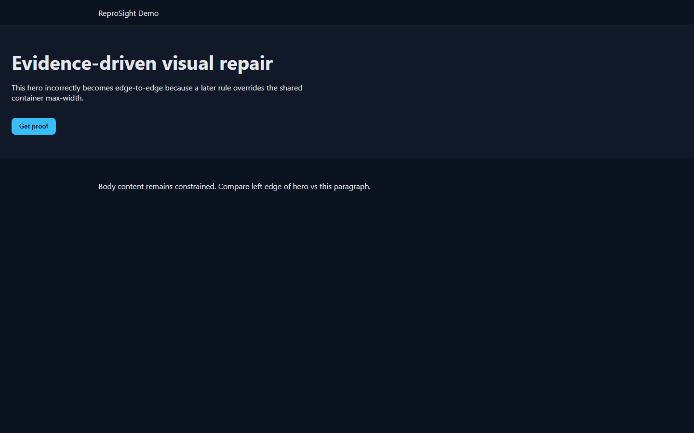
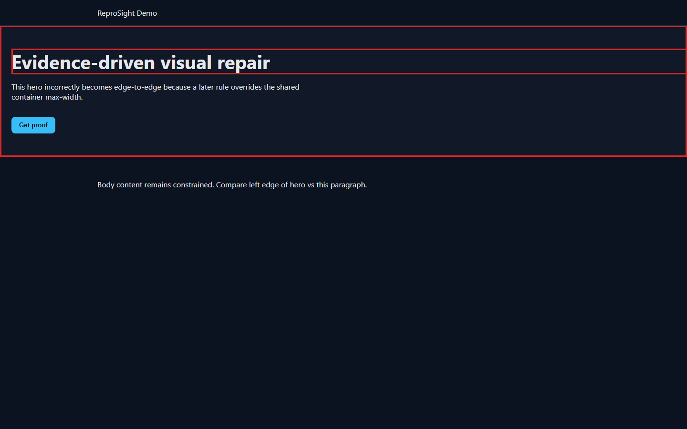
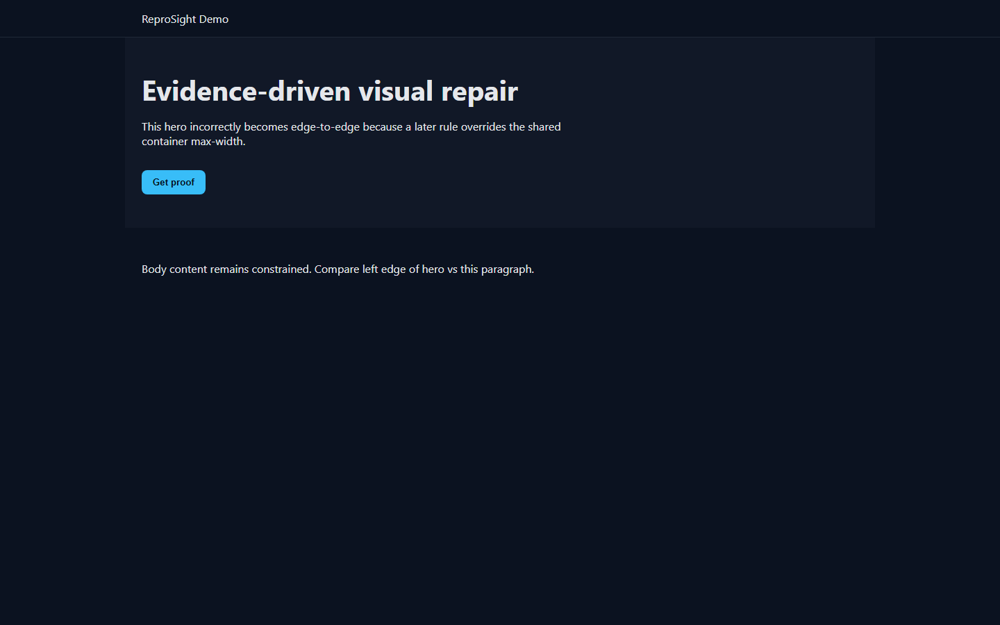
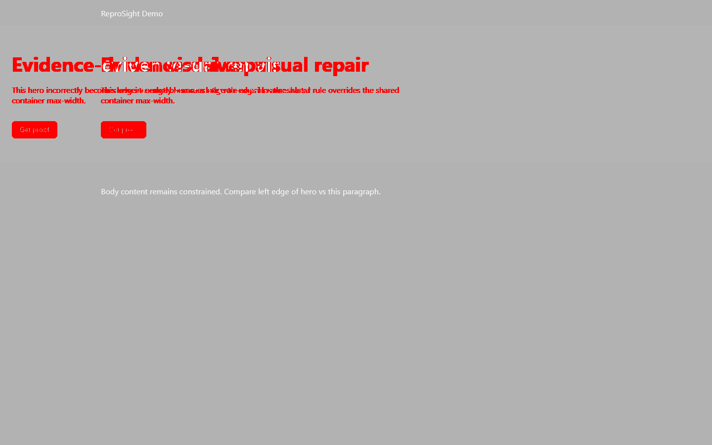

# ReproSight — Evidence-driven AI Visual Repair

**Visual defect → measured evidence → authored CSS rule → minimal patch → isolated worktree verification → regression proof → human review.**

ReproSight does not merely suggest a fix. It produces evidence showing whether the fix worked.

## Flagship proof: container stretch

At 1440px, a Hero that also uses `.container` becomes edge-to-edge because a later `.hero` rule overrides the shared container max-width.

| Before | Annotated | After | Diff |
| --- | --- | --- | --- |
|  |  |  |  |

Self-contained report: [artifacts/demo/report-container-stretch.html](artifacts/demo/report-container-stretch.html)

Second flagship (Vietnamese tablet overflow): [artifacts/demo/report-locale-overflow.html](artifacts/demo/report-locale-overflow.html)

## Why screenshot diff alone is insufficient

- Diffs do not name the offending DOM node or authored CSS rule
- Intentional redesign vs breakage is ambiguous
- Locale/theme/viewport matrices explode baselines
- A green pixel match is not a geometric proof that overflow/occlusion is gone

## Architecture (one pipeline)

```
Issue JSON
  → deterministic Chromium reproduction
  → detectors + CDP source localization
  → model diagnosis (mock in CI; OpenAI-compatible optional)
  → patch policy
  → linked Git worktree only
  → target + regression verification
  → HTML report / dashboard review
  → AWAITING_HUMAN_REVIEW
```

See [docs/architecture.md](docs/architecture.md).

## Quick start

```bash
npm ci
npx playwright install chromium
npm run typecheck
npm run lint
npm test
npm run build
npm run benchmark:detectors
npm run benchmark:localization
npm run e2e:mock
npm run evaluation:mock-matrix
npm run evaluation:real-provider   # blocked without OPENAI_API_KEY
```

### Flagship CLI (mock provider)

```bash
node packages/cli/dist/index.js run examples/issues/container-stretch.json \
  --config examples/configs/container-stretch.config.json \
  --provider mock
```

### Dashboard

```bash
npm run dev -w @reprosight/dashboard
# http://127.0.0.1:5173
# deep link: /run/<run-id>
# artifact root: <workspace>/.reprosight/runs (Vite middleware, no manual copy)
```

## Verified evaluation results (this repository)

Four categories are **never** merged into one success rate.

### 1) Deterministic detector benchmark

- **12/12** expected primary detectors hit
- **10 consecutive full runs passed** (see `artifacts/audit/detector-10x.txt`)
- Command: `npm run benchmark:detectors`

### 2) Deterministic source localization

From `artifacts/benchmark/localization-analysis.json`:

| Metric | Value |
| --- | ---: |
| Cases | 12 |
| Top-1 | **83.3%** (10/12) |
| Top-3 | **100%** (12/12) |

Failure categories:

- `correct`: 10
- `ambiguous-cascade`: 2 (`locale-overflow-vi-768`, `mobile-nav-overflow`)

### 3) Mock orchestration benchmark

Label: **Orchestration and verification success with deterministic mock provider**  
(Not real-model repair accuracy.)

- **6/6** clean-room cases → `AWAITING_HUMAN_REVIEW`
- Worktree-only apply, original checkout hash unchanged, regressions clean, no new axe/console
- Commands: `npm run e2e:mock`, `npm run evaluation:mock-matrix`

### 4) Real-provider repair evaluation

Status: **blocked** — no `OPENAI_API_KEY` in this environment (value never logged).

```bat
set OPENAI_API_KEY=***
set REPROSIGHT_MODEL_BASE_URL=https://api.openai.com/v1
set REPROSIGHT_MODEL_NAME=gpt-4o-mini
npm run evaluation:real-provider
```

Artifact: `artifacts/evaluation/real-provider.json`

## Safety model

- Issue actions are a fixed allow-list (no arbitrary JS)
- Page/repo content is untrusted data to the model
- Secrets redacted from console/network evidence
- Patch policy: relative paths, globs, size limits; forbid global `overflow-x: hidden` on html/body
- Target checkout must be clean; repairs only in `.reprosight/worktrees/<run-id>/`
- Human approval updates ReproSight metadata / export only — never commit/merge/push the target

## Honest limitations

- MVP fixture set — **not** a broad scientific benchmark
- Automated axe checks are partial (not a full WCAG audit)
- Pixel diffs are environment-sensitive
- Localization top-1 is not 100% (ambiguous cascade remains)
- Real-model accuracy is unmeasured until a provider key is available
- Trace zip capture is optional and may be absent
- Demo video: not recorded in-repo (see [docs/demo-script.md](docs/demo-script.md) for the walkthrough)

## Documentation

- [Research](docs/research.md) · [Architecture](docs/architecture.md) · [Evaluation](docs/evaluation.md)
- [Threat model](docs/threat-model.md) · [Limitations](docs/limitations.md) · [Demo script](docs/demo-script.md)

## License

MIT
