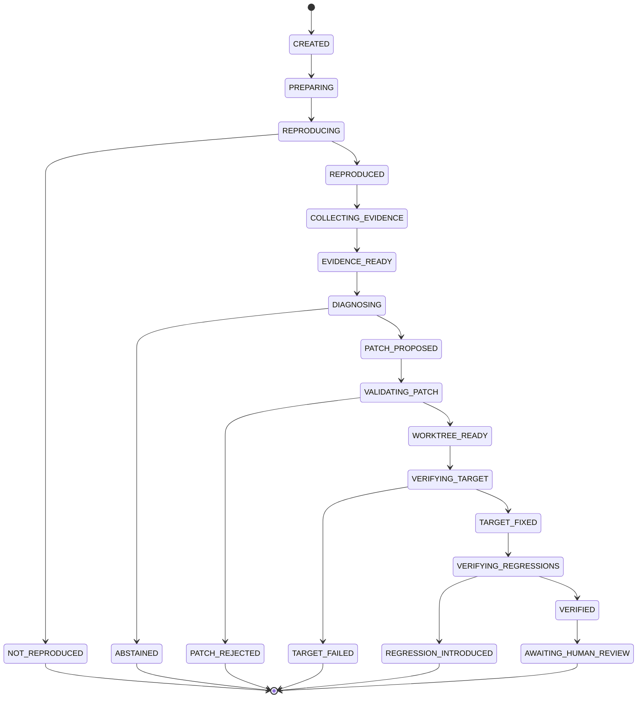
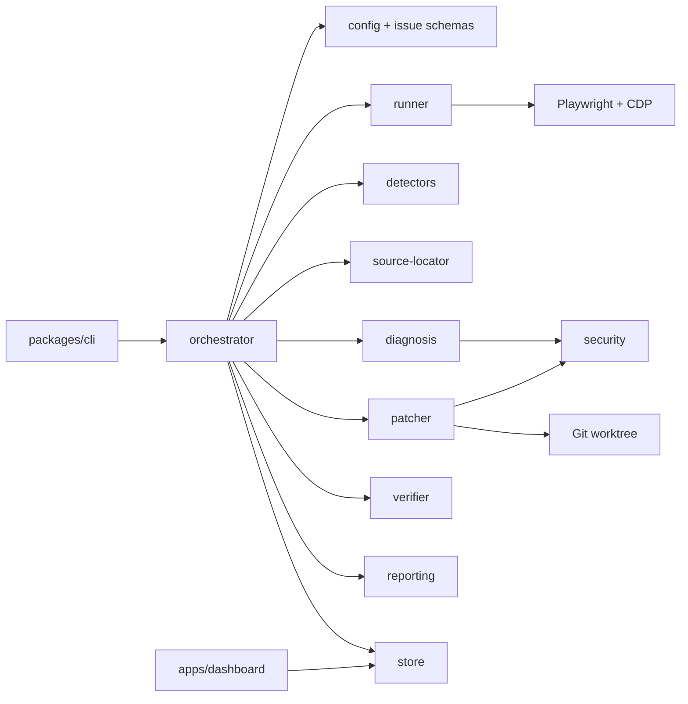
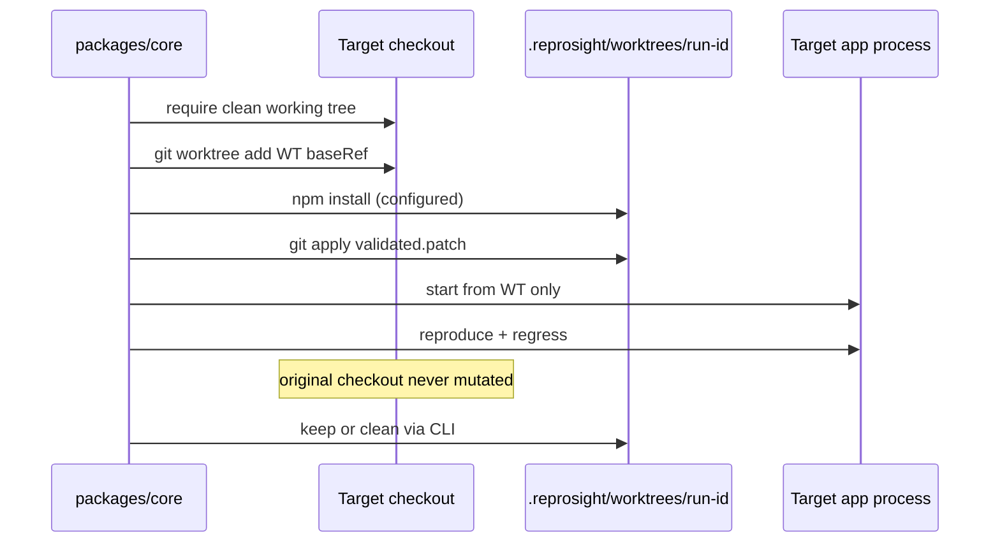

# ReproSight Architecture

## One-sentence system shape

ReproSight is a TypeScript monorepo that runs an explicit pipeline: reproduce → collect evidence → localize CSS → diagnose (optional model) → validate patch → apply in isolated worktree → verify → report.

## Package boundaries

```
apps/dashboard          Local React UI that reads run artifacts (no repair execution)
packages/cli            User-facing commands; thin orchestration entry
packages/core           All pipeline logic, schemas, security, store
packages/benchmark      Fixture harness and metric aggregation
fixtures/*              Deterministic buggy mini-sites
examples/*              Sample configs and issues
```

`packages/core` is the only package that talks to Playwright, CDP, Git worktrees, and model providers. The CLI and dashboard depend on core; core does not depend on them.

## Pipeline state machine



Each transition is persisted with timestamp, previous state, new state, reason, and artifact IDs.

## Module map



## Target worktree isolation



## Artifact flow

```
.reprosight/runs/<run-id>/
  run.json
  issue.json
  config.snapshot.json
  environment.json
  reproduction.json
  evidence.json
  diagnosis.json
  patch.diff
  patch-validation.json
  verification.json
  report/index.html
  artifacts/*
```

Missing artifacts are represented explicitly in `run.json` rather than omitted silently.

## Determinism boundaries

| Layer | Deterministic? | Notes |
| --- | --- | --- |
| Config / issue validation | Yes | Zod schemas |
| Browser setup / actions | Yes | Fixed action types only |
| Detectors | Yes | Geometry + axe |
| Source localization | Yes | CDP + scoring |
| Model diagnosis | No | Provider-dependent; mock used in CI |
| Patch policy | Yes | Diff parse + globs + limits |
| Worktree apply | Yes | native git |
| Verification | Yes | same detectors/assertions |
| Human review | Manual | required for approval |

## Security boundaries

- Model receives structured evidence only; page/repo content is untrusted data
- Model has no shell tool and returns JSON only
- Patch paths must be relative, non-traversing, and glob-allowed
- Secrets are redacted from stored console/network evidence
- Original target checkout is integrity-checked around repair

## Extension points

- Additional detectors implement a shared detector interface
- Model providers implement `ModelClient`
- Reports and dashboard read the same artifact schema
- Benchmark cases are plain fixtures + issue JSON + expected metadata
